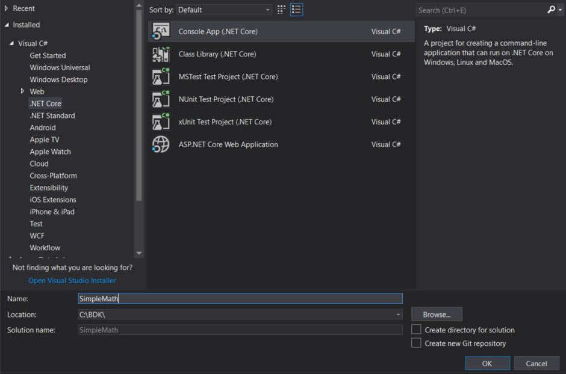
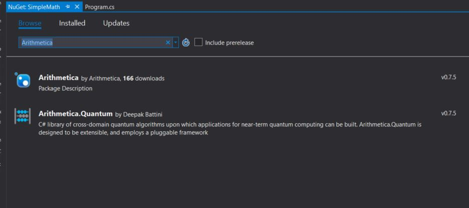

# How to start?

Arithmetica is a .NET library written in .NET standard. 
The nuget is up-to date with the stable version of the library. Let us see how to use it in a simple console application.

1. Open Visual Studio (Preferred 2015 and above)
2. Create a new .NET Core Console Project with name "SimpleMath"

3. Once the project is created, right click on the project and select Manage Nuget Packages.
4. Search for Arithmetica, click and install the latest version.

5. Great, now open Program.cs and import the following namespace.
```csharp
using Arithmetica.LinearAlgebra.Single;
```
6. In the main function, implement the following code to perform two vector calculation.
```csharp
//Create a float vector loaded with array
SingleVector a = SingleVector.LoadArray(1, 2, 3, 4, 5, 6);

//Create a float vector with constant value
SingleVector b = new SingleVector(6);
b.Fill(2.5f);

//Perform the math calculation y = sin(a) + exp(b)
SingleVector y = SingleVector.Sin(a) + SingleVector.Exp(b);
y.Print();
```

Now run the console to see the result. 

